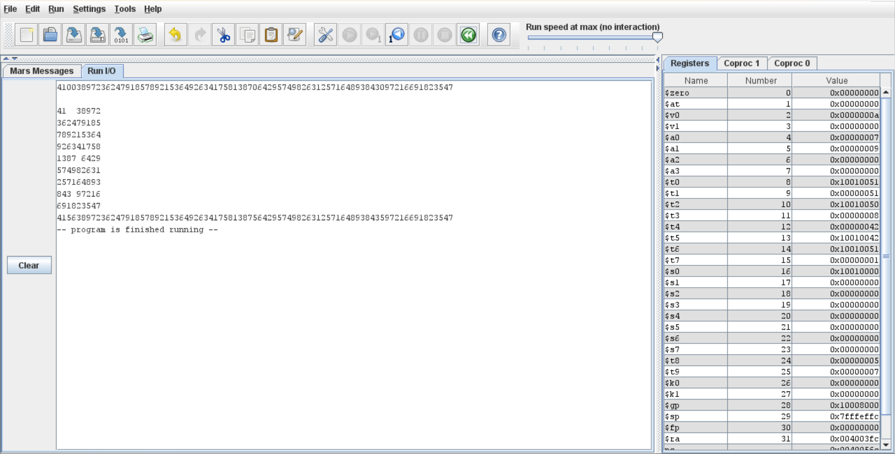

# Sudoku Project

On souhaite développer une application qui résous un sudoku **en code assembleur**.

**sudoku :** Jeu de stratégie consistant en une grille divisée en neuf sections où l'on doit placer les chiffres de 1 à 9 de façon qu'ils ne figurent qu'une fois dans une même ligne, une même colonne et une même section.

- Membres du goupe : [Jean GIESE](https://git.unistra.fr/jgiese), [Abdullah NEZAMI](https://git.unistra.fr/nezami)

## Installation / lancement du jeu

Ouvrez un terminal et mettez-vous dans un répertoire où vous placerez le projet

### Mise en place du dépôt Git

1. Installer git sur votre ordinateur personnel (rien à faire si vous avez déjà Git) :
```sh
sudo apt install git
```

2. Configurer vos informations d'utilisateur :
```sh
git config --global user.name "[Prenom] [Nom]"
git config --global user.email "[email]"
```

3. Cloner ce dépôt sur votre ordinateur personnel :
```sh
git clone https://github.com/Jean-GIESE/Sudoku-Game.git
```
Ce projet à été fait sur MARS avec la version 4.5. Si vous n'avez pas MARS sur votre ordinateur, installez-le via le [site web](https://www.softpedia.com/get/Programming/Coding-languages-Compilers/Vollmar-MARS.shtml)

### Lancement du jeu

Lancez MARS, ouvrez l'un des 2 fichiers .asm et cliquez sur Assemble (icône de marteau 🛠️). Puis sur Run ▶️ pour exécuter ton code.

**Résultats :** Les sorties (syscall) apparaissent dans la console de MARS.

## Description

Comme dis ci-dessus, le projet et de créer un programme qui résout un sudoku mis en paramètre, soit à l'aide d'un fichier à part, soit directement dans le code.

Pour ce faire, nous avons dispersé les tâches en trois grandes parties:

- une partie contenant des fonctions permettant de **lire un fichier .txt et mettre le contenu du fichier dans une variable (nommée grille dans notre cas),**
- une partie contenant des fonctions permettant de **résoudre le sudoku enièrement,**
- une partie contenant des fonctions permettant **l'affichage du sudoku dans la console.**

Pour une raison que j'ignore, la version qui prend en paramètre le fichier .txt (sujet_sudoku.asm), ne fonctionne plus et renvoie -48, il me semble avoir déjà rencontré ce problème et l'avoir résolu mais le souvenir est trop flou.

En revanche, la version qui prend le sudoku directement en dur dans le code (sujet_sudoku2.asm) fonctionne.

## Screenshot



